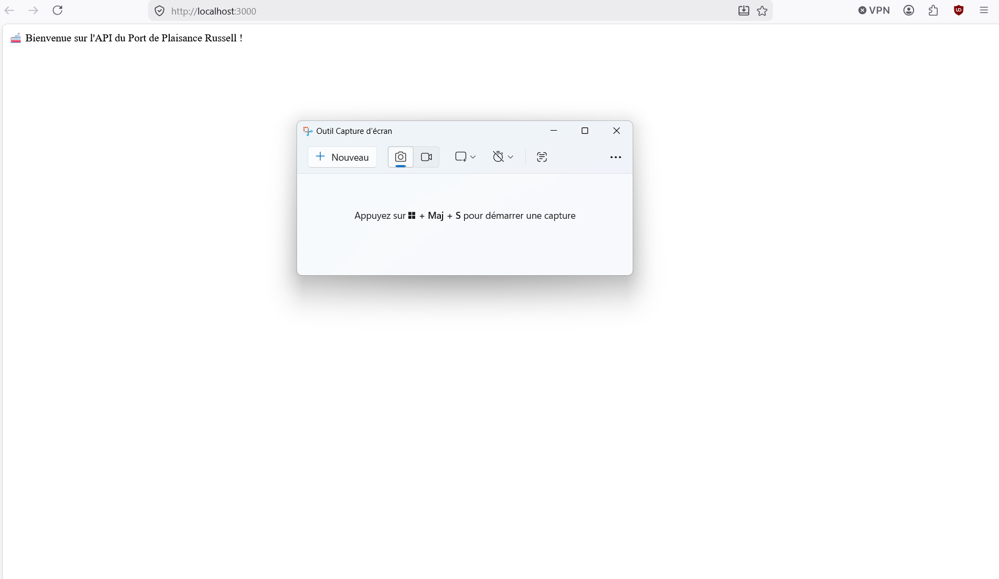
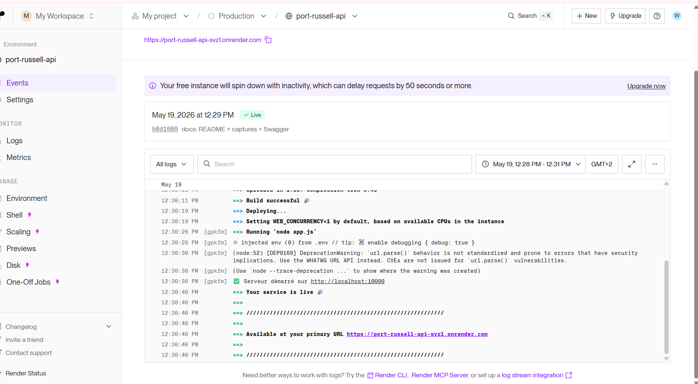
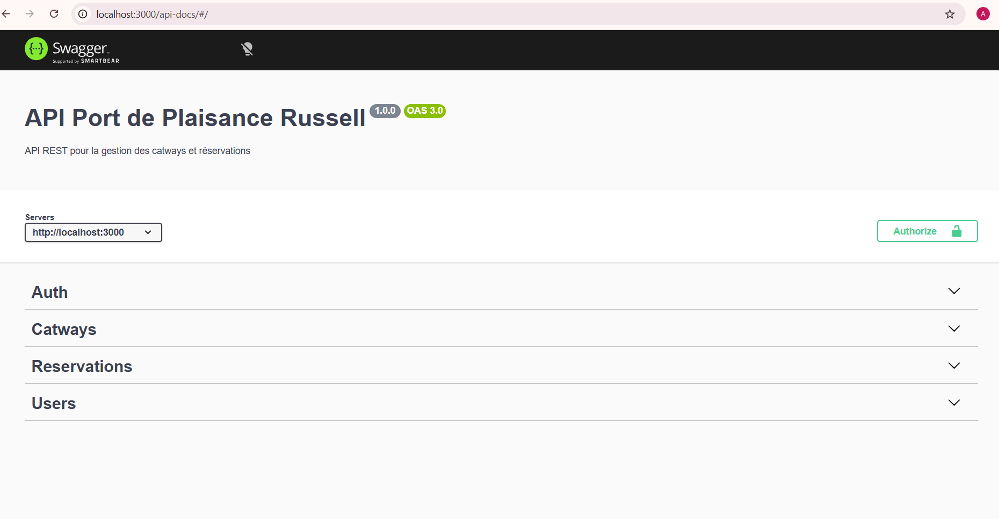
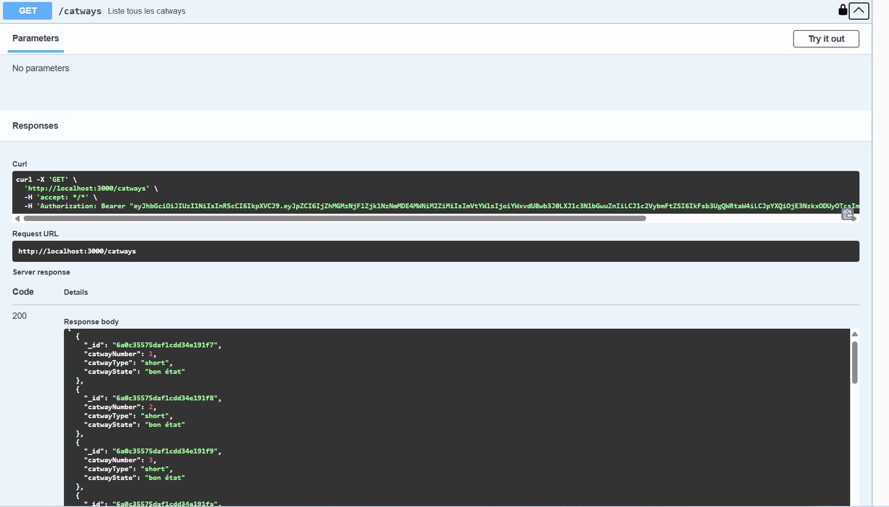
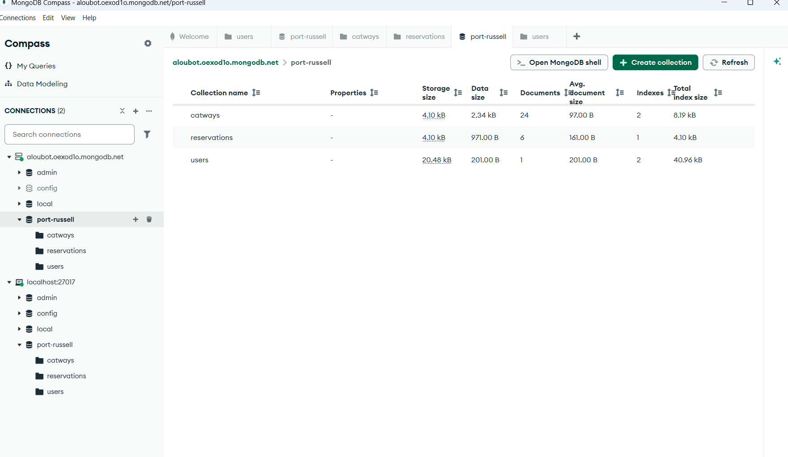

# 🚢 API Port de Plaisance Russell

Application de gestion des réservations de catways pour le Port de Russell.  
Devoir développeur web - **CEF 2026**.

---

## 🎯 Fonctionnalités

- 🔐 Authentification JWT (login/logout)
- ⛵ CRUD complet des catways
- 📅 CRUD des réservations (sous-ressource des catways)
- 👤 CRUD des utilisateurs (avec mots de passe hashés bcrypt)
- 🌐 Interface web (EJS) avec tableau de bord
- 📚 Documentation interactive Swagger

---

## 🛠️ Stack technique

- **Backend** : Node.js + Express
- **Base de données** : MongoDB + Mongoose
- **Vues** : EJS + CSS
- **Sécurité** : JWT + bcrypt + cookie-parser
- **Documentation** : Swagger UI

---

## 📦 Installation locale

\`\`\`bash
git clone https://github.com/Alou-boy/port-russell-api.git
cd port-russell-api
npm install
\`\`\`

## ⚙️ Configuration

Créer un fichier **.env** à la racine :

\`\`\`
PORT=3000
MONGO_URI=mongodb://localhost:27017/port-russell
JWT_SECRET=ta_cle_secrete_jwt
\`\`\`

## 🚀 Lancement

\`\`\`bash
npm run dev
\`\`\`

Le serveur démarre sur **http://localhost:3000**

---

## 🔗 Liens importants

- 🌐 **Application en ligne** : [À COMPLÉTER après l'étape 12]
- 📚 **Documentation API (Swagger)** : http://localhost:3000/api-docs
- 🏠 **Page d'accueil** : http://localhost:3000
- 🌐 **Application en ligne** : https://port-russell-api-svz1.onrender.com
- 📚 **Documentation API** : https://port-russell-api-svz1.onrender.com/api-docs

---

## 👤 Compte de test

| Champ | Valeur |
|---|---|
| Email | alou@port-russell.fr |
| Mot de passe | motdepasse123 |

---

## 📸 Captures d'écran

### Page d'accueil

### Tableau de bord

### Documentation Swagger

### Tests Postman

### MongoDB Compass

---

## 📂 Structure du projet

\`\`\`
port-russell-api/
├── config/         # Configuration (DB, Swagger)
├── controllers/    # Logique des routes
├── middlewares/    # Auth JWT
├── models/         # Schémas Mongoose
├── routes/         # Définition des endpoints
├── views/          # Pages EJS
├── public/         # CSS, JS, images
├── data/           # Données JSON initiales
└── app.js          # Point d'entrée
\`\`\`

---

## 👨‍💻 Auteur

**Alassane Ndour** (Alou-boy)  
GitHub : [@Alou-boy](https://github.com/Alou-boy)  
Formation Développeur Web - CEF 2026